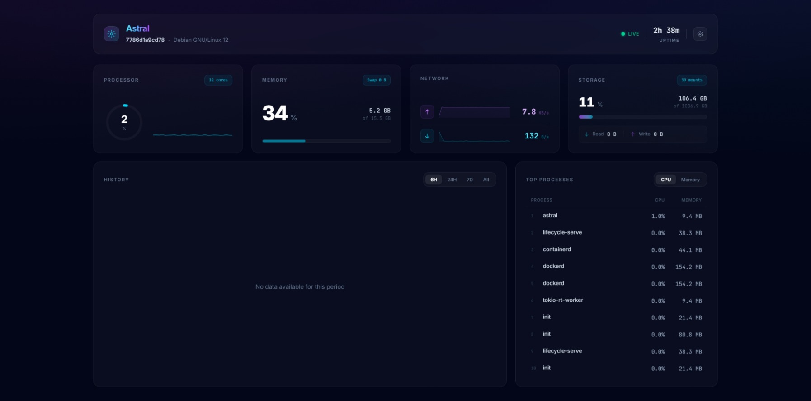

# Astral

<p align="center">
  
</p>
<p align="center">
  <a href="https://github.com/arifintahu/astral/stargazers"></a>
  <a href="LICENSE"></a>
</p>

Astral is a pragmatic, ultra-lightweight server monitoring dashboard. It bridges the gap between basic CLI tools like `htop` and complex observability stacks like Prometheus/Grafana.

Astral provides a modern, single-page web UI that displays real-time system health and historical trends, secured by default, with built-in webhook alerting—all packaged into a single, easily deployable binary.



## Features

-   **Real-time Monitoring:** Live updates (1-second intervals) for CPU, Memory, Network, and Disk usage via Server-Sent Events (SSE).
-   **Historical Data:** Interactive charts for viewing trends over 6 hours, 24 hours, or 7 days, backed by an embedded SQLite database.
-   **Single Binary Deployment:** The Svelte frontend is embedded directly into the Rust binary. No external runtime dependencies (Node.js, Python, etc.) required on the host.
-   **Secure by Default:** HMAC-SHA256 session tokens with per-login nonces, `HttpOnly; SameSite=Strict` cookies, Argon2 password hashing, login rate limiting, server-side session revocation, and a full set of security headers (CSP, HSTS, X-Frame-Options).
-   **Alerting:** Configurable webhook alerts (HTTPS only) for high CPU or memory usage (sustained 5 minutes), with a 15-minute per-kind cooldown to prevent alert floods.
-   **Lightweight:** Minimal resource footprint, designed for small to medium-sized VPS and servers.

## Benchmarks

Running `./benchmark.sh` on a standard development environment:

| Metric | Value |
| :--- | :--- |
| **Binary Size** | 7.1M (7362848 bytes) |
| **Execution Time** | 1.53ms (Time to Ready) |
| **Peak Memory (RSS)** | 8.88 MB |

## Installation

### Download Binary

Pre-built binaries for Linux (amd64), Windows (amd64), and macOS (Apple Silicon) are available on the [Releases](https://github.com/yourusername/astral/releases) page.

1.  Download the latest release for your platform.
2.  Make the binary executable (Linux/macOS):
    ```bash
    chmod +x astral-linux-amd64
    ```
3.  Run it:
    ```bash
    ./astral-linux-amd64
    ```

### Docker Deployment

For production environments, deploying via Docker ensures a consistent runtime and easy updates.

The provided `docker-compose.yml` is configured to run Astral with host networking and PID access, allowing it to monitor the host system accurately.

1.  **Set credentials via environment variable:**
    ```bash
    cp .env.example .env
    # Set ASTRAL_AUTH=youruser:yourpassword in .env
    ```

2.  **Start the service:**
    ```bash
    docker-compose up -d --build
    ```

3.  **Access the dashboard:**
    Open `http://<your-server-ip>:8080` (behind a TLS-terminating reverse proxy in production — see [TLS](#tls) below).

**Important Notes:**
-   **Host Monitoring:** Astral requires `--network host` and `--pid host` (along with `/proc` and `/sys` mounts) to accurately monitor the host system's CPU, memory, and network usage from within a container. Without these, it will only monitor the container's isolated environment.
-   **Data Persistence:** The SQLite database is stored in `/app/data` inside the container. Use a volume (e.g., `astral_data`) to persist historical data across restarts.
-   **Credentials:** Pass `ASTRAL_AUTH=user:pass` as an environment variable rather than a CLI flag. This keeps the password out of `docker inspect` output and process lists.

### Build from Source

To build Astral from source, you need:
-   **Rust:** Latest stable version (install via [rustup](https://rustup.rs/)).
-   **Node.js & npm:** For building the frontend assets.

1.  **Clone the repository:**
    ```bash
    git clone https://github.com/arifintahu/astral.git
    cd astral
    ```

2.  **Build the Frontend:**
    ```bash
    cd web
    npm install
    npm run build
    cd ..
    ```

3.  **Build & Run the Backend:**
    ```bash
    cargo run --release
    ```

    Or build a release binary:
    ```bash
    cargo build --release
    # Binary will be at target/release/astral
    ```

## Usage

By default, Astral listens on port `8080`.

```bash
./astral [OPTIONS]
```

### Configuration

Credentials can be supplied via environment variable (recommended — avoids exposing the password in `ps` output and shell history) or via the `--auth` flag:

```bash
# Preferred: environment variable
ASTRAL_AUTH=admin:secret123 ./astral

# Alternative: flag (visible in process list — avoid on shared hosts)
./astral --auth admin:secret123
```

If neither is provided, Astral generates random credentials and prints them once to stderr on startup.

### Flags

| Flag | Env var | Description | Default |
| :--- | :--- | :--- | :--- |
| `--port <PORT>` | — | Port to listen on. | `8080` |
| `--auth <USER:PASS>` | `ASTRAL_AUTH` | Login credentials. | auto-generated |
| `--webhook <URL>` | — | HTTPS webhook URL for alerts. | `None` |
| `--alert-cpu <%>` | — | CPU threshold for alerts (0–100). | `90` |
| `--alert-ram <%>` | — | Memory threshold for alerts (0–100). | `90` |
| `--enable-process-list` | — | Include top processes in the live feed. | off |

> **Note:** `--webhook` only accepts `https://` URLs. HTTP webhook URLs are rejected to prevent SSRF.

### Examples

**Run with default settings (auto-generated credentials printed to stderr):**
```bash
./astral
```

**Run with custom credentials and port:**
```bash
ASTRAL_AUTH=admin:secret123 ./astral --port 3000
```

**Run with webhook alerting and process list enabled:**
```bash
ASTRAL_AUTH=admin:secret123 ./astral \
  --webhook https://discord.com/api/webhooks/... \
  --alert-cpu 80 \
  --enable-process-list
```

## TLS

Astral does not terminate TLS itself. For any network-exposed deployment, place it behind a reverse proxy that handles TLS:

**Caddy** (automatic HTTPS):
```caddyfile
monitor.example.com {
    reverse_proxy localhost:8080
}
```

**nginx:**
```nginx
server {
    listen 443 ssl;
    server_name monitor.example.com;
    ssl_certificate     /etc/ssl/certs/cert.pem;
    ssl_certificate_key /etc/ssl/private/key.pem;

    location / {
        proxy_pass http://127.0.0.1:8080;
        proxy_set_header X-Forwarded-Proto https;
    }
}
```

Without TLS, the session cookie and login credentials are transmitted in plaintext.

## Development

To run the project in development mode:

1.  **Start the Frontend (HMR):**
    ```bash
    cd web
    npm run dev
    ```
    *Note: The Rust backend expects the frontend to be built in `web/dist`. For true hot-reloading dev experience, you might need to proxy requests or rebuild the frontend on changes.*

2.  **Run the Backend:**
    ```bash
    cargo run
    ```

## License

This project is licensed under the MIT License - see the [LICENSE](LICENSE) file for details.
